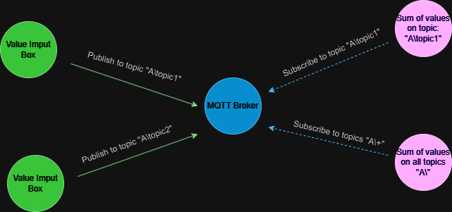

# MQTTApp

MQTTApp is a Qt-based desktop application that illustrates the data transfer via the MQTT protocol. It allows users to publish and subscribe to topics and visualize message flow in real-time.

## Features

* Real-time publishing and subscription to MQTT topics.
* User-friendly interface for interacting with MQTT brokers.
* Supports multiple topics and wildcard subscriptions.
* Displays incoming messages for subscribed topics.
* Cross-platform support, built using the Qt framework.
* Doxygen support
* Permissive license

## Set-up Diagram

Below is a diagram explaining how the components are communicating with each other through the MQTT broker:


## Getting Started

These instructions will get you a copy of the project up and running on your local machine.

### Prerequisites

* **Qt 6.1.1** - [https://doc.qt.io/](https://doc.qt.io/)

* **Qt MQTT lib ver. 6.1.1** - [https://github.com/qt/qtmqtt](https://github.com/qt/qtmqtt)

> ***Note:*** *You need to integrate the qtmqtt library into the ***Qt*** enviorment.*

### Installing

Clone the MQTTApp repository from [GitHub](https://github.com/ionitovt/MQTTApp.git):

```bash
git clone https://github.com/ionitovt/MQTTApp.git
```

## Building the project

To build the project, all you need to do, ***after correctly
[installing the project](README.md#Installing)***, is to set up **Qt**

When you start the Qt Creator and open the project you will be prompted to
choose a compiler kit. Choose the kit appropriate for your system.

Example:
If you want to build the application for Windows choose
the **Desktop Qt 6.6.1 MinGW 64-bit** kit and click build

## Documentation

The project uses Doxygen for generating code documentation.
You can find the Doxygen HTML output in the "Documentation/html" directory. 
Open index.html in your web browser to view the documentation.

You can also check the User Manual `MQTTApp_Tutorial.pdf` in the "Documentation" directory.

## Generating the Doxygen documentation

In order to generate documentation for the project, you need use Doxygen.

If you do not have Doxygen installed, download and install it from the [official Doxygen website](http://www.doxygen.nl/).
Ensure that the `doxygen` command is available in your system's PATH.

***For Linux follow these steps:**

Open a terminal and navigate to the root directory of the MQTTApp 
project where the configuration file (`Doxyfile`) is located.

Run Doxygen with:
```bash
doxygen Doxyfile
```

***For Windows:**

For Windows you can open the `DoxyWizard` and load the current 
configuration from the DoxyFile and click the "Run doxygen" button
as shown below:


## Authors

* **Yoan Tyankovski** - [@filipdutescu](https://github.com/ionitovt)

## License

This project is licensed under the [Unlicense](https://unlicense.org/) - see the
[LICENSE](LICENSE.txt) file for details
